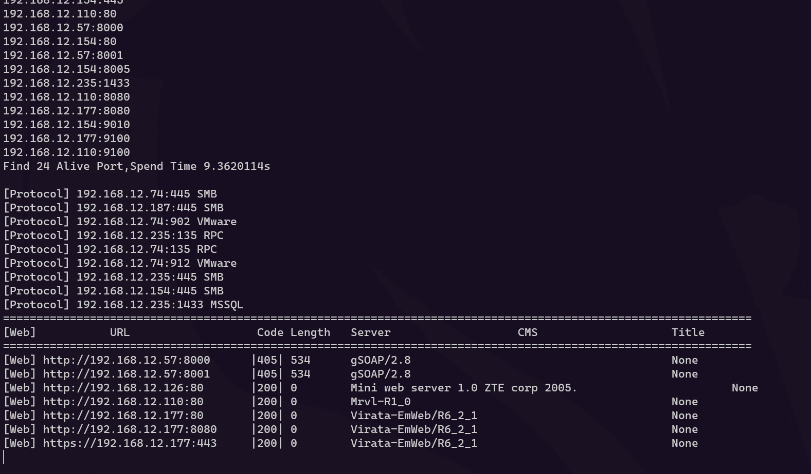

# Taiji

Taiji-Golang高并发红队打点横向移动内网渗透扫描器（主机存活探测、端口扫描、Web指纹识别、弱口令爆破）

可配合FindSubs子域名收集进行红队打点信息收集一条龙。

# 使用示例

## 帮助

```bash
Taiji -h
```


## 资产梳理（基本用法）

端口扫描+Web指纹识别

```bash
Taiji -ip 192.168.12.1/24

#添加 -vuln 选项可以进行弱口令爆破和系统漏洞扫描（ms17-010、CVE-2020-0796）
```



## 大量URL探活和Web指纹识别

```bash
Taiji -ip urls.txt -m webscan
```


## 网站图标hash计算

```bash
Taiji -ip 8.1xx.1xx.39 -port 8885 -m icon_hash
```


## 密码喷洒

在通过抓hash或者其他途径获取到一台内网主机的密码时，用这个密码去碰撞猜解其它主机密码

```bash
Taiji -ip 192.168.12.1/24 -vuln -port 22 -user root -pwd root@123
```

## 其他

其他功能自己看看吧，很简单，-log 能保存扫描结果。

代码开源给对安全开发感兴趣的朋友参考。

应用指纹规则不开源，但是可执行程序里的指纹是能用的。

## 网络安全知识库(推荐)

### 地址：[https://wintrysec.github.io](https://wintrysec.github.io/)

[](https://github.com/wintrysec/FindSubs/blob/master/img/image-20230423200400217.png)

